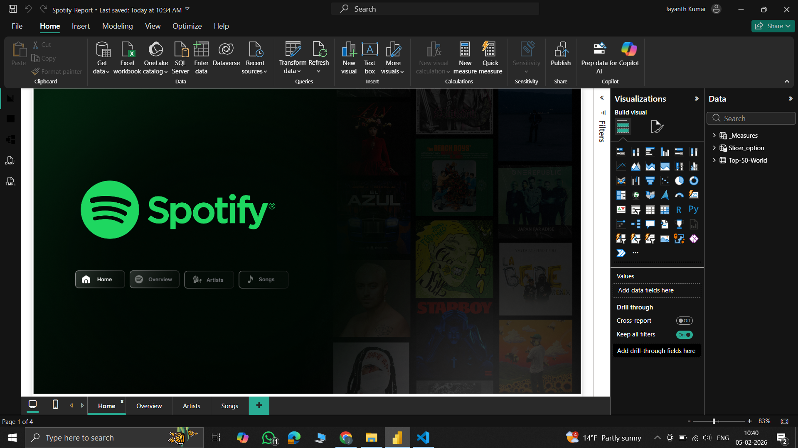
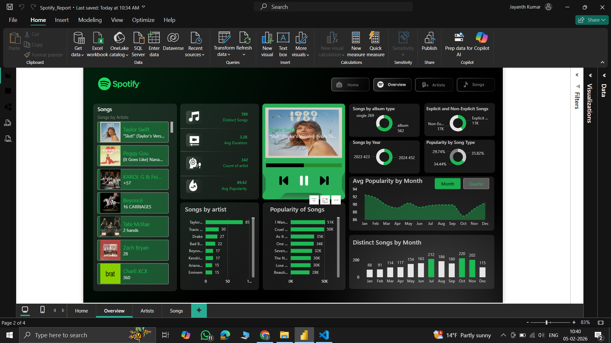
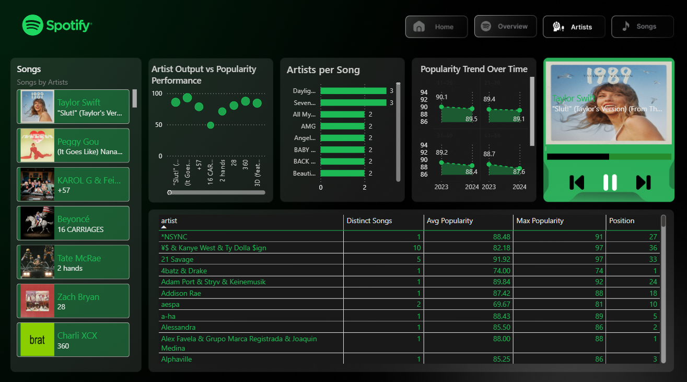
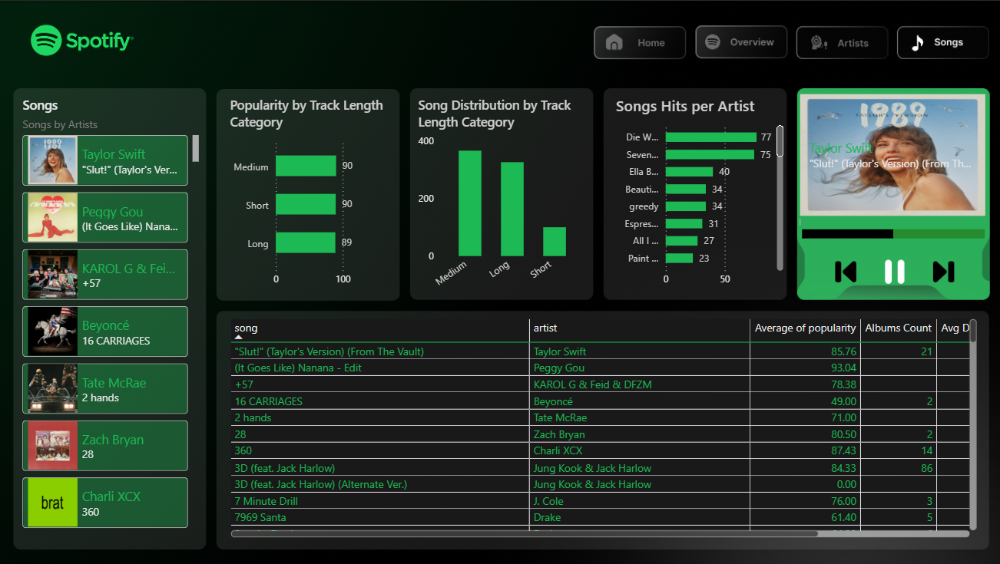

# 🎧 Spotify Top 50 Global — Power BI Analytics Dashboard

An end-to-end Power BI data analytics project analyzing Spotify Global Top 50 songs using interactive dashboards, feature engineering, and data storytelling.

This report explores song performance, artist impact, popularity trends, and listening behavior patterns using business intelligence and data science–inspired visualizations.

## 📌 Project Overview

This dashboard answers key music analytics questions:

-> What makes a song popular?

-> Do shorter songs perform better?

-> Do artists succeed through volume or quality?

-> How does chart position relate to popularity?

-> How does explicit content affect engagement?

-> How does popularity change over time?

## 🛠 Tech Stack

-> Power BI Desktop

-> DAX (Measures + Calculated Columns)

-> Data Modeling

-> Feature Engineering (Buckets, Segmentation)

-> Data Visualization & Storytelling

## 📊 Dashboard Pages

### 🏠 Home Page

Landing page with branding and navigation across report sections.

Features:

-> Spotify themed UI

-> Navigation buttons

-> Background storytelling design

### 📈 Overview Page — High Level Performance Metrics

Provides overall dataset insights and macro trends.

Key Visuals:

-> Total Songs KPI

-> Distinct Artists KPI

-> Avg Song Duration KPI

-> Avg Popularity KPI

-> Songs by Album Type

-> Explicit vs Non Explicit Distribution

-> Popularity Trend Over Time

-> Monthly Song Distribution

### 🎤 Artists Page — Artist Performance Analytics

Focuses on artist-level success patterns and performance strategy.

Key Visuals:

-> Artist Output vs Popularity Performance

-> Artists Per Song Distribution

-> Artist Popularity Trend Over Time

-> Artist Performance Table

Insights Generated:

-> Relationship between artist catalog size and popularity

-> Artist consistency vs viral success

-> Artist engagement trends over time

### 🎵 Songs Page — Song Level Behavioral Analysis

Deep dive into track-level performance and listener behavior patterns.

Key Visuals:

-> Popularity by Track Length Category

-> Song Distribution by Track Length Category

-> Song Hits Ranking

-> Song Performance Table

-> Feature Engineering Used:

-> Track Length Bucketing (Short / Medium / Long)

-> Position Range Segmentation

-> Popularity Distribution Analysis

Insights Generated:

-> Optimal track length trends

-> Popularity performance patterns

-> Hit concentration across songs

## 🧠 Key Data Engineering & Analytics Techniques

Feature Engineering:

-> Track Length Buckets

-> Position Range Buckets

-> Explicit Content Segmentation

-> Popularity Distribution Analysis

DAX Measures:

Examples:

-> Avg Popularity

-> Explicit Song %

-> Avg Duration Minutes

-> Songs per Artist

-> Popularity per Year

-> Position 1 Hit Count

## 📸 Dashboard Preview

### 🏠 Home Page

### 🎤 Overview Page

### 👨‍🎤 Artists Page

### 🎵 Artists Page

## 📈 Business & Product Insights

-> Medium-length tracks show strong popularity balance

-> Top chart positions strongly correlate with high popularity scores

-> Artist catalog size does not always guarantee higher popularity

-> Explicit content shows varying popularity impact by artist and time

## 🚀 How to Use

1. Download the .pbix file

2. Open in Power BI Desktop

3. Interact with filters, slicers, and visuals

## 👤 Author

Jayanth Kumar
